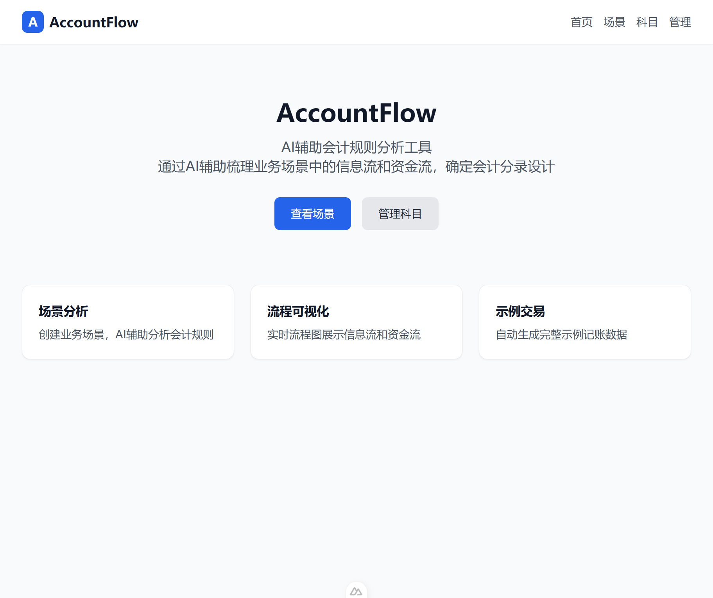
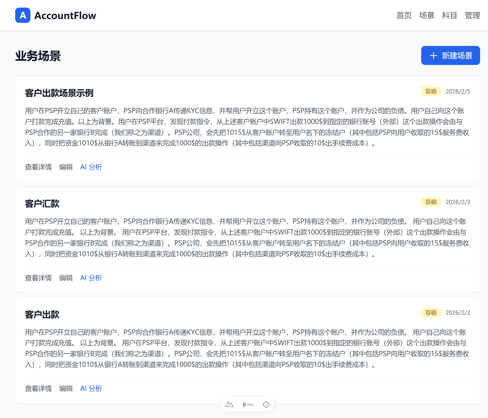
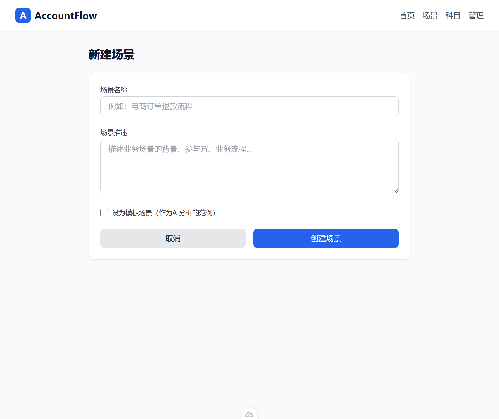
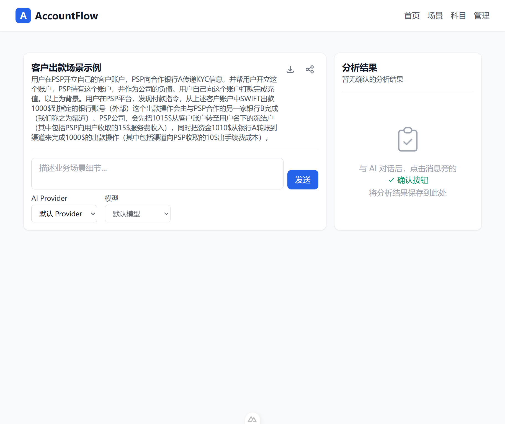
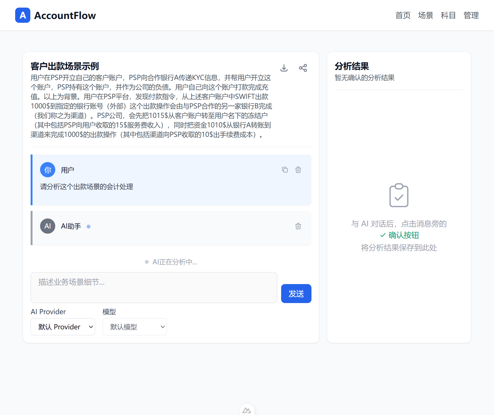
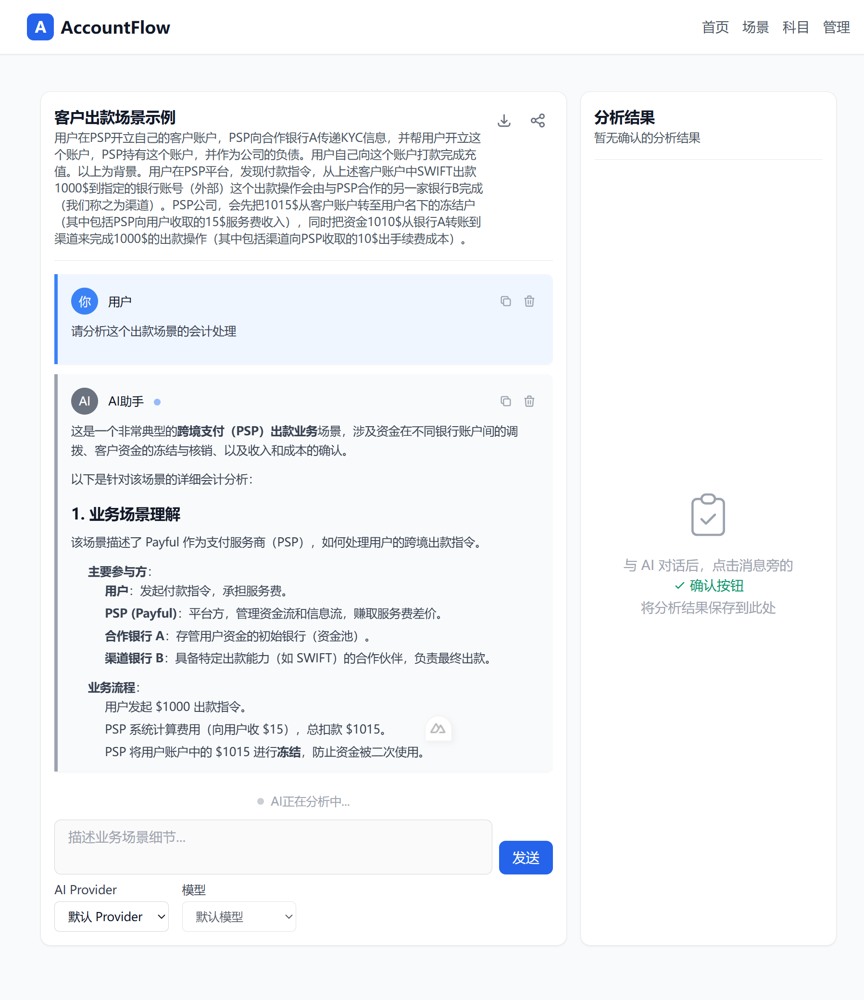
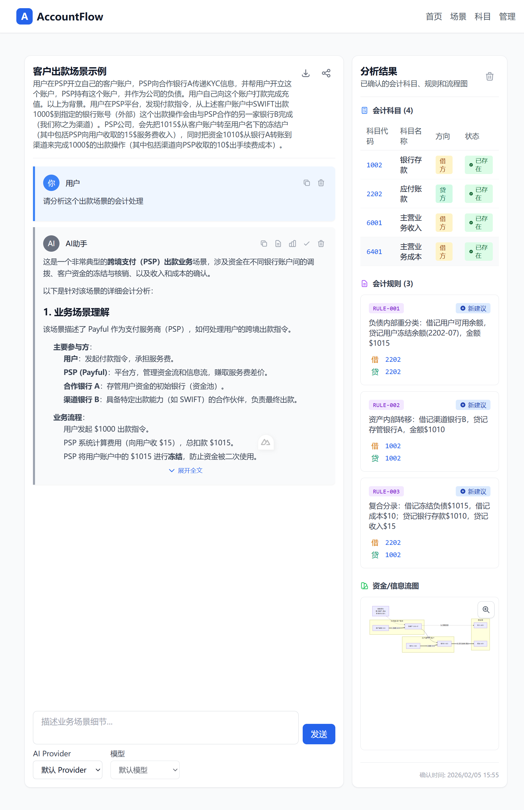
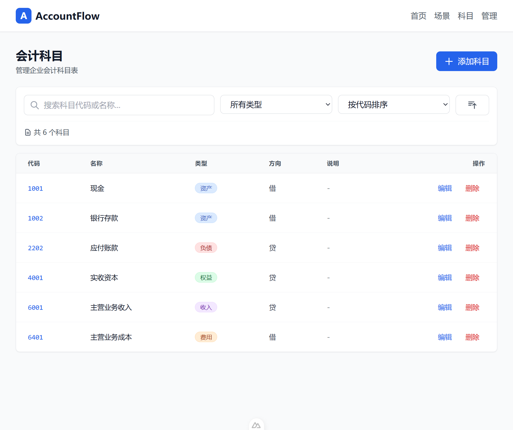

# AccountFlow 使用指南

## 📖 概述

AccountFlow 是一个 AI 辅助的会计规则分析工具，通过智能分析业务场景，自动生成会计分录规则和流程图。本指南将带您了解主要功能的使用方法。

## 🚀 快速开始

### 1. 访问首页



首页展示了 AccountFlow 的核心功能：
- **场景分析**：创建业务场景，AI 辅助分析会计规则
- **流程可视化**：实时流程图展示信息流和资金流  
- **示例交易**：自动生成完整示例记账数据

### 2. 场景管理



点击导航栏的"场景"进入场景管理页面：
- 查看所有已创建的业务场景
- 每个场景显示名称、状态、创建时间
- 点击"新建场景"创建新的业务分析
- 可以直接点击"AI 分析"进入已有场景的分析界面

## 📝 创建业务场景

### 1. 填写场景信息



在新建场景页面：
- **场景名称**：为业务场景起一个清晰的名称
- **场景描述**：详细描述业务背景、参与方、业务流程等
- **模板场景**：可选择设为模板，供后续分析参考

### 2. 示例场景内容

```
场景名称：客户出款场景示例

场景描述：
用户在PSP开立自己的客户账户，PSP向合作银行A传递KYC信息，并帮用户开立这个账户，PSP持有这个账户，并作为公司的负债。用户自己向这个账户打款完成充值。以上为背景。用户在PSP平台，发现付款指令，从上述客户账户中SWIFT出款1000$到指定的银行账号（外部）这个出款操作会由与PSP合作的另一家银行B完成（我们称之为渠道）。PSP公司，会先把1015$从客户账户转至用户名下的冻结户（其中包括PSP向用户收取的15$服务费收入），同时把资金1010$从银行A转账到渠道来完成1000$的出款操作（其中包括渠道向PSP收取的10$出手续费成本）。
```

## 🤖 AI 分析过程

### 1. 进入分析界面



创建场景后，自动进入分析界面：
- **左侧**：显示场景基本信息和对话历史
- **右侧**：AI 对话区域和分析结果展示区
- **底部**：输入框用于发送分析请求
- **AI Provider 选择**：可以选择不同的 AI 模型进行分析

### 2. 开始 AI 分析



在输入框中输入分析请求，例如：
- "请分析这个出款场景的会计处理"
- "帮我梳理这个业务的资金流向"
- "生成相应的会计分录规则"

AI 将实时分析并显示处理进度，可以看到：
- 用户消息显示在左侧对话区
- AI 正在分析的状态提示
- 实时的流式响应输出

### 3. 查看分析结果



AI 分析完成后，将提供：

#### 📊 业务场景理解
- 主要参与方识别（用户、PSP、合作银行、渠道银行）
- 业务流程梳理（发起指令→计算费用→冻结资金→调拨资金→执行出款）
- 核心逻辑分析（跨境支付业务的关键环节）

#### 🎯 关键事件识别
- **资金冻结**：负债内部重分类，从可用余额转为冻结余额
- **资金调拨**：资产内部转移，从存管行转到渠道行
- **出款核销**：资产减少、负债减少、收入与费用确认

#### 📋 会计科目选择
- **1002 银行存款**（资产）：核算各合作银行的实际资金
- **2202 应付账款**（负债）：核算对用户的负债，区分可用和冻结
- **6001 主营业务收入**（收入）：核算向用户收取的服务费
- **6401 主营业务成本**（费用）：核算支付给渠道的手续费

#### 🔄 流程图可视化
- **业务流程图**：展示完整的业务处理步骤和决策分支
- **资金/信息流图**：显示资金流向（实线）和信息传递（虚线）

#### 📝 会计分录规则
详细的分录表格包含：
- 业务事件描述
- 借方科目和金额
- 贷方科目和金额
- 分录说明
- 平衡检查（借方总额 = 贷方总额）

#### 💾 结构化数据
- JSON 格式的完整分析数据
- 可用于系统集成和二次开发
- 包含流程图、科目、规则的完整结构

## ✅ 确认分析结果

### 1. 确认按钮

点击 AI 回复旁的"确认分析结果"按钮，将分析结果保存到场景中。

### 2. 查看确认结果



确认后，右侧将显示：

#### 📊 会计科目汇总
- 所有涉及的会计科目（4个科目）
- 科目类型和方向（资产/负债/收入/费用）
- 系统状态（已存在于系统中）

#### 📏 会计规则列表
- 编号化的会计规则（RULE-001、RULE-002、RULE-003）
- 借贷对应关系
- 详细的分录说明和金额

#### 🌐 流程图展示
- 可放大的流程图
- 资金流向可视化
- 信息传递路径

#### ⏰ 确认时间
- 记录分析确认的时间戳

## 🏛️ 会计科目管理

### 科目管理界面



在"科目"页面可以：
- **查看科目列表**：浏览所有会计科目（共6个科目）
- **搜索科目**：按代码或名称搜索
- **筛选排序**：按类型、方向等筛选和排序
- **添加新科目**：创建新的会计科目

### 科目信息展示
- **代码**：会计科目编码（如1001、1002、2202等）
- **名称**：科目名称（现金、银行存款、应付账款等）
- **类型**：资产/负债/权益/收入/费用
- **方向**：借方/贷方
- **操作**：编辑和删除功能

## 💡 使用技巧

### 1. 场景描述要点
- **背景信息**：说明业务环境和行业背景
- **参与方**：列出所有相关方及其角色
- **流程步骤**：详细描述业务流程的每个环节
- **金额数据**：提供具体的金额和费率信息
- **特殊要求**：说明特殊的会计处理需求

### 2. 分析请求示例
- "分析这个场景的会计处理"
- "生成完整的会计分录"
- "梳理资金流向和信息流"
- "识别关键会计事件"
- "设计会计科目映射"

### 3. 结果确认
- 仔细检查 AI 生成的会计规则
- 确认科目选择符合企业会计制度
- 验证借贷平衡关系
- 保存结果前可多次分析调整

## 🔧 高级功能

### 1. 模型选择
- 支持多种 AI 模型（默认 Provider、ominiLink 等）
- 可根据分析需求选择合适的模型
- 不同模型有不同的分析风格和深度

### 2. 对话历史
- 保存完整的分析对话
- 可查看 AI 的分析思路和过程
- 支持复制和导出对话记录

### 3. 结果导出
- 支持导出分析结果
- 可生成 Word/PDF 格式报告
- JSON 数据便于系统集成

## 🎯 最佳实践

1. **详细描述**：提供尽可能详细的业务场景描述
2. **逐步分析**：复杂场景可分步骤让 AI 分析
3. **验证结果**：确认前仔细验证会计规则的准确性
4. **保存模板**：将典型场景设为模板供后续使用
5. **定期更新**：根据业务变化更新场景和规则

## 📞 技术支持

如需技术支持或功能建议，请：
- 查看系统帮助文档
- 联系系统管理员
- 提交功能反馈

---

*AccountFlow - 让会计规则分析更智能、更高效*
